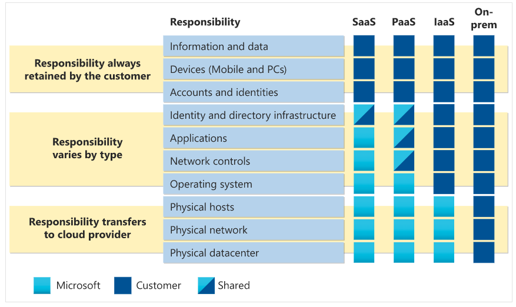

### Cloud services
- compute
- networking
- storage

### Describe the shared responsibility model

With an on-premises datacenter, you’re responsible for everything. With cloud computing, those responsibilities shift. The shared responsibility model is heavily tied into the cloud service types (covered later in this learning path): infrastructure as a service (IaaS), platform as a service (PaaS), and software as a service (SaaS). IaaS places the most responsibility on the consumer, with the cloud provider being responsible for the basics of physical security, power, and connectivity. On the other end of the spectrum, SaaS places most of the responsibility with the cloud provider. PaaS, being a middle ground between IaaS and SaaS, rests somewhere in the middle and evenly distributes responsibility between the cloud provider and the consumer.

**You’ll always be responsible for**:
- The information and data stored in the cloud
- Devices that are allowed to connect to your cloud (cell phones, computers, and so on)
- The accounts and identities of the people, services, and devices within your organization 

**The cloud provider is always responsible for:**
- The physical datacenter
- The physical network
- The physical hosts

**Your service model will determine responsibility for things like:**
- Operating systems
- Network controls
- Applications
- Identity and infrastructure

### Define cloud models
The cloud models define the deployment type of cloud resources

**Private cloud**

Private cloud provides much greater control for the company and its IT department. However, it also comes with greater cost and fewer of the benefits of a public cloud deployment. Finally, a private cloud may be hosted from your on site datacenter. It may also be hosted in a dedicated datacenter offsite, potentially even by a third party that has dedicated that datacenter to your company.

**Public cloud**

A public cloud is built, controlled, and maintained by a third-party cloud provider. With a public cloud, anyone that wants to purchase cloud services can access and use resources. The general public availability is a key difference between public and private clouds.

**Hybrid cloud**

A hybrid cloud is a computing environment that uses both public and private clouds in an inter-connected environment.
 A hybrid cloud environment can be used to allow a private cloud to surge for increased, temporary demand by deploying public cloud resources. Hybrid cloud can be used to provide an extra layer of security

**Multi-cloud**

A fourth, and increasingly likely scenario is a multi-cloud scenario. In a multi-cloud scenario, you use multiple public cloud providers. Maybe you use different features from different cloud providers. Or maybe you started your cloud journey with one provider and are in the process of migrating to a different provider. Regardless, in a multi-cloud environment you deal with two (or more) public cloud providers and manage resources and security in both environments.

**Azure Arc**

Azure Arc is a set of technologies that helps manage your cloud environment. Azure Arc can help manage your cloud environment, whether it's a public cloud solely on Azure, a private cloud in your datacenter, a hybrid configuration, or even a multi-cloud environment running on multiple cloud providers at once.

**Azure VMware Solution**
What if you’re already established with VMware in a private cloud environment but want to migrate to a public or hybrid cloud? Azure VMware Solution lets you run your VMware workloads in Azure with seamless integration and scalability.

### Describe the consumption-based model
When comparing IT infrastructure models, there are two types of expenses to consider. **Capital expenditure (CapEx)** and **operational expenditure (OpEx)**.

**CapEx** is typically a one-time, up-front expenditure to purchase or secure tangible resources. A new building, repaving the parking lot, building a datacenter, or buying a company vehicle are examples of CapEx
**OpEx** is spending money on services or products over time. Renting a convention center, leasing a company vehicle, or signing up for cloud services are all examples of OpEx.

Cloud computing falls under **OpEx** because cloud computing operates on a consumption-based model. With cloud computing, you don’t pay for the physical infrastructure, the electricity, the security, or anything else associated with maintaining a datacenter. Instead, you pay for the IT resources you use. If you don’t use any IT resources this month, you don’t pay for any IT resources.

This consumption-based model has many benefits, including:

- No upfront costs.
- No need to purchase and manage costly infrastructure that users might not use to its fullest potential.
- The ability to pay for more resources when they're needed.
- The ability to stop paying for resources that are no longer needed.

