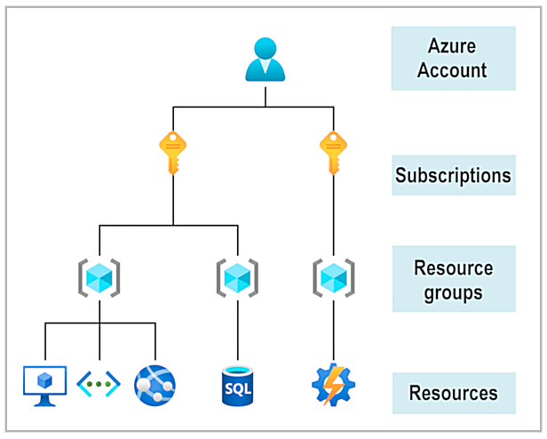
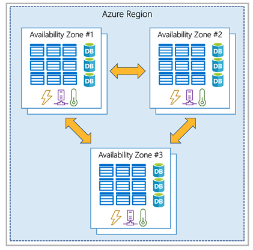
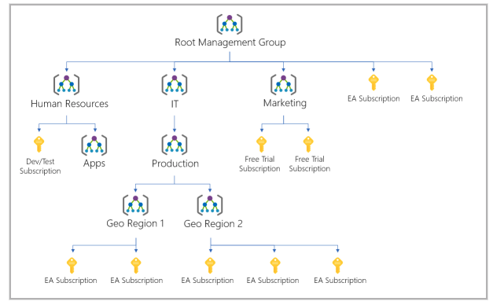

## What is Microsoft Azure

Azure is a continually expanding set of cloud services that help you meet current and future business challenges. Azure gives you the freedom to build, manage, and deploy applications on a massive global network using your favorite tools and frameworks.

### What can I do with Azure?
Azure provides more than 100 services that enable you to do everything from running your existing applications on virtual machines to exploring new software paradigms, such as intelligent bots and mixed reality.

Many teams start exploring the cloud by moving their existing applications to virtual machines (VMs) that run in Azure. Migrating your existing apps to VMs is a good start, but the cloud is much more than a different place to run your VMs.

For example, Azure provides artificial intelligence (AI) and machine-learning (ML) services that can naturally communicate with your users through vision, hearing, and speech. It also provides storage solutions that dynamically grow to accommodate massive amounts of data. Azure services enable solutions that aren't feasible without the power of the cloud.


## Get started with Azure accounts
To create and use Azure services, you need an Azure subscription. When you're completing Learn modules, most of the time a temporary subscription is created for you, which runs in an environment called the Learn sandbox. When you're working with your own applications and business needs, you need to create an Azure account, and a subscription will be created for you. After you've created an Azure account, you're free to create additional subscriptions. For example, your company might use a single Azure account for your business and separate subscriptions for development, marketing, and sales departments. After you've created an Azure subscription, you can start creating Azure resources within each subscription.



### What is the Azure free account?
The Azure free account includes:

- Free access to popular Azure products for 12 months.
- A credit to use for the first 30 days.
- Access to more than 25 products that are always free.

The Azure free account is an excellent way for new users to get started and explore. To sign up, you need a phone number, a credit card, and a Microsoft or GitHub account. The credit card information is used for identity verification only. You won't be charged for any services until you upgrade to a paid subscription.

### What is the Microsoft Learn sandbox?
Many of the Learn exercises use a technology called the sandbox, which creates a temporary subscription that's added to your Azure account. This temporary subscription allows you to create Azure resources during a Learn module. Learn automatically cleans up the temporary resources for you after you've completed the module.

When you're completing a Learn module, you're welcome to use your personal subscription to complete the exercises in a module. However, the sandbox is the preferred method to use because it allows you to create and test Azure resources at no cost to you.

### Testing the Sandbox

by default, you're in a PowerShell mode:
```shell
Get-date
az version
```

You can enter bash mode: 
```shell
bash
date
az upgrade
```

For more interactive help and autocomplete options, run:

```shell
az interactive
```

Exit bash mode
```shell
exit
```


## Describe Azure physical infrastructure
The core architectural components of Azure may be broken down into two main groupings: 
- the physical infrastructure, and 
- the management infrastructure.

### Physical infrastructure
The physical infrastructure for Azure starts with datacenters. Conceptually, the datacenters are the same as large corporate datacenters. They’re facilities with resources arranged in racks, with dedicated power, cooling, and networking infrastructure.



As a global cloud provider, Azure has datacenters around the world. However, these individual datacenters aren’t directly accessible. Datacenters are grouped into Azure Regions or Azure Availability Zones that are designed to help you achieve resiliency and reliability for your business-critical workloads.

The [Global infrastructure](https://infrastructuremap.microsoft.com/) site gives you a chance to interactively explore the underlying Azure infrastructure.

#### Regions
A region is a geographical area on the planet that contains at least one, but potentially multiple datacenters that are nearby and networked together with a low-latency network. Azure intelligently assigns and controls the resources within each region to ensure workloads are appropriately balanced.

####  Availability Zones
Availability zones are physically separate datacenters within an Azure region. Each availability zone is made up of one or more datacenters equipped with independent power, cooling, and networking. An availability zone is set up to be an isolation boundary. If one zone goes down, the other continues working. Availability zones are connected through high-speed, private fiber-optic networks.

Availability zones are primarily for VMs, managed disks, load balancers, and SQL databases. Azure services that support availability zones fall into three categories:

Zonal services: You pin the resource to a specific zone (for example, VMs, managed disks, IP addresses).
Zone-redundant services: The platform replicates automatically across zones (for example, zone-redundant storage, SQL Database).
Non-regional services: Services are always available from Azure geographies and are resilient to zone-wide outages as well as region-wide outages.
Even with the additional resiliency that availability zones provide, it’s possible that an event could be so large that it impacts multiple availability zones in a single region. To provide even further resilience, Azure has Region Pairs.

#### Region pairs
Most Azure regions are paired with another region within the same geography (such as US, Europe, or Asia) at least 300 miles away. This approach allows for the replication of resources across a geography that helps reduce the likelihood of interruptions because of events such as natural disasters, civil unrest, power outages, or physical network outages that affect an entire region. For example, if a region in a pair was affected by a natural disaster, services would automatically fail over to the other region in its region pair.

**Additional advantages of region pairs:**
- If an extensive Azure outage occurs, one region out of every pair is prioritized to make sure at least one is restored as quickly as possible for applications hosted in that region pair.
- Planned Azure updates are rolled out to paired regions one region at a time to minimize downtime and risk of application outage.
- Data continues to reside within the same geography as its pair (except for Brazil South) for tax- and law-enforcement jurisdiction purposes.

#### Sovereign Regions
In addition to regular regions, Azure also has sovereign regions. Sovereign regions are instances of Azure that are isolated from the main instance of Azure. You may need to use a sovereign region for compliance or legal purposes.

Azure sovereign regions include:

- US DoD Central, US Gov Virginia, US Gov Iowa and more: These regions are physical and logical network-isolated instances of Azure for U.S. government agencies and partners. These datacenters are operated by screened U.S. personnel and include additional compliance certifications.
- China East, China North, and more: These regions are available through a unique partnership between Microsoft and 21Vianet, whereby Microsoft doesn't directly maintain the datacenters


## Describe Azure management infrastructure
The management infrastructure includes Azure resources and resource groups, subscriptions, and accounts. Understanding the hierarchical organization will help you plan your projects and products within Azure.

### Azure resources and resource groups

The management infrastructure includes Azure resources and resource groups, subscriptions, and accounts. Understanding the hierarchical organization will help you plan your projects and products within Azure.

Resource groups are simply groupings of resources. When you create a resource, you’re required to place it into a resource group. While a resource group can contain many resources, a single resource can only be in one resource group at a time.

Resource groups provide a convenient way to group resources together. When you apply an action to a resource group, that action will apply to all the resources within the resource group. If you delete a resource group, all the resources will be deleted. If you grant or deny access to a resource group, you’ve granted or denied access to all the resources within the resource group. If you’re provisioning compute resources that will need three different access schemas, it may be best to group resources based on the access schema, and then assign access at the resource group level.


### Azure subscriptions
In Azure, subscriptions are a unit of management, billing, and scale. Similar to how **resource groups are a way to logically organize resources**, **subscriptions allow you to logically organize your resource groups** and facilitate billing.

Using Azure requires an Azure subscription. A subscription provides you with authenticated and authorized access to Azure products and services. It also allows you to provision resources. An Azure subscription links to an Azure account, which is an identity in Azure Active Directory (Azure AD) or in a directory that Azure AD trusts.

An account can have multiple subscriptions, but it’s only required to have one. In a multi-subscription account, you can use the subscriptions to configure different billing models and apply different access-management policies. You can use Azure subscriptions to define boundaries around Azure products, services, and resources. There are two types of subscription boundaries that you can use:

- **Billing boundary**: This subscription type determines how an Azure account is billed for using Azure. You can create multiple subscriptions for different types of billing requirements. Azure generates separate billing reports and invoices for each subscription so that you can organize and manage costs.
- **Access control boundary**: Azure applies access-management policies at the subscription level, and you can create separate subscriptions to reflect different organizational structures. An example is that within a business, you have different departments to which you apply distinct Azure subscription policies. This billing model allows you to manage and control access to the resources that users provision with specific subscriptions.

### Create additional Azure subscriptions
Similar to using resource groups to separate resources by function or access, you might want to create additional subscriptions for resource or billing management purposes. For example, you might choose to create additional subscriptions to separate:

- **Environments**: You can choose to create subscriptions to set up separate environments for development and testing, security, or to isolate data for compliance reasons. This design is particularly useful because resource access control occurs at the subscription level.
- **Organizational structures**: You can create subscriptions to reflect different organizational structures. For example, you could limit one team to lower-cost resources, while allowing the IT department a full range. This design allows you to manage and control access to the resources that users provision within each subscription.
- **Billing**: You can create additional subscriptions for billing purposes. Because costs are first aggregated at the subscription level, you might want to create subscriptions to manage and track costs based on your needs. For instance, you might want to create one subscription for your production workloads and another subscription for your development and testing workloads.


### Azure management groups
If you have many subscriptions, you might need a way to efficiently manage access, policies, and compliance for those subscriptions. Azure management groups provide a level of scope above subscriptions. You organize subscriptions into containers called management groups and apply governance conditions to the management groups. All subscriptions within a management group automatically inherit the conditions applied to the management group, the same way that resource groups inherit settings from subscriptions and resources inherit from resource groups. Management groups give you enterprise-grade management at a large scale, no matter what type of subscriptions you might have. Management groups can be nested.

### Management group, subscriptions, and resource group hierarchy
You can build a flexible structure of management groups and subscriptions to organize your resources into a hierarchy for unified policy and access management. The following diagram shows an example of creating a hierarchy for governance by using management groups.



Some examples of how you could use management groups might be:

- Create a hierarchy that applies a policy. You could limit VM locations to the US West Region in a group called Production. This policy will inherit onto all the subscriptions that are descendants of that management group and will apply to all VMs under those subscriptions. This security policy can't be altered by the resource or subscription owner, which allows for improved governance.
- Provide user access to multiple subscriptions. By moving multiple subscriptions under a management group, you can create one Azure role-based access control (Azure RBAC) assignment on the management group. Assigning Azure RBAC at the management group level means that all sub-management groups, subscriptions, resource groups, and resources underneath that management group would also inherit those permissions. One assignment on the management group can enable users to have access to everything they need instead of scripting Azure RBAC over different subscriptions.

